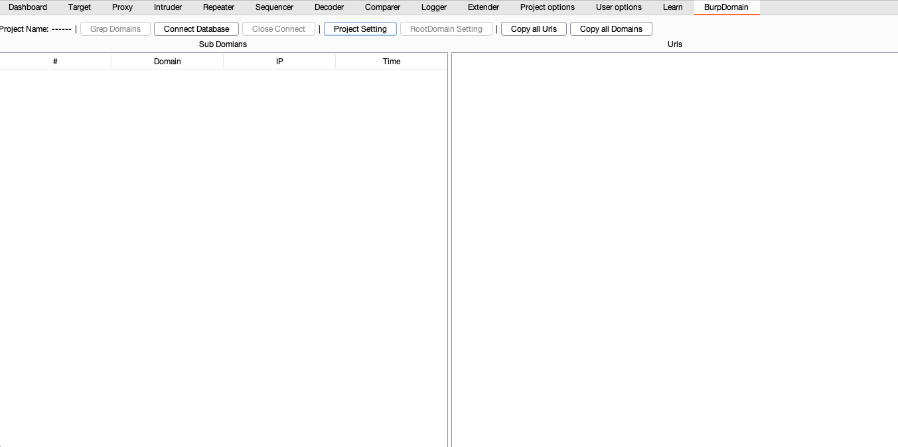
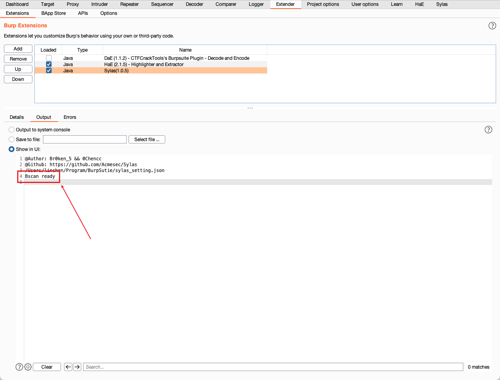
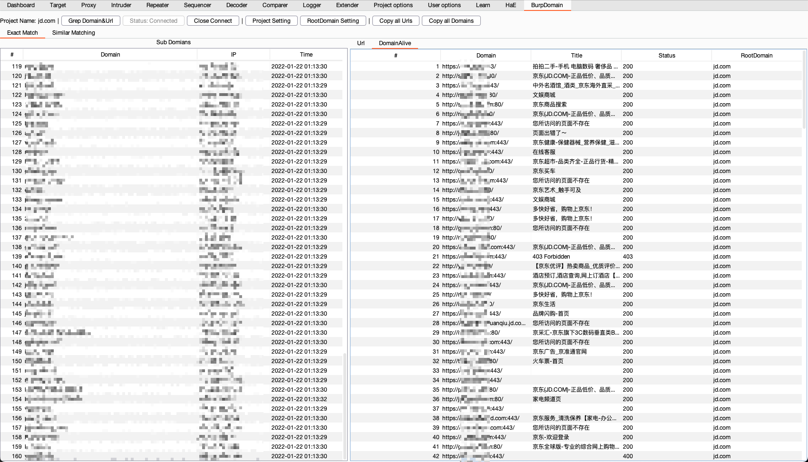
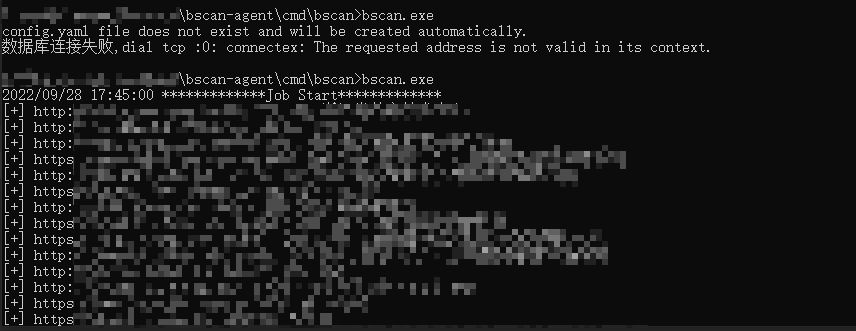
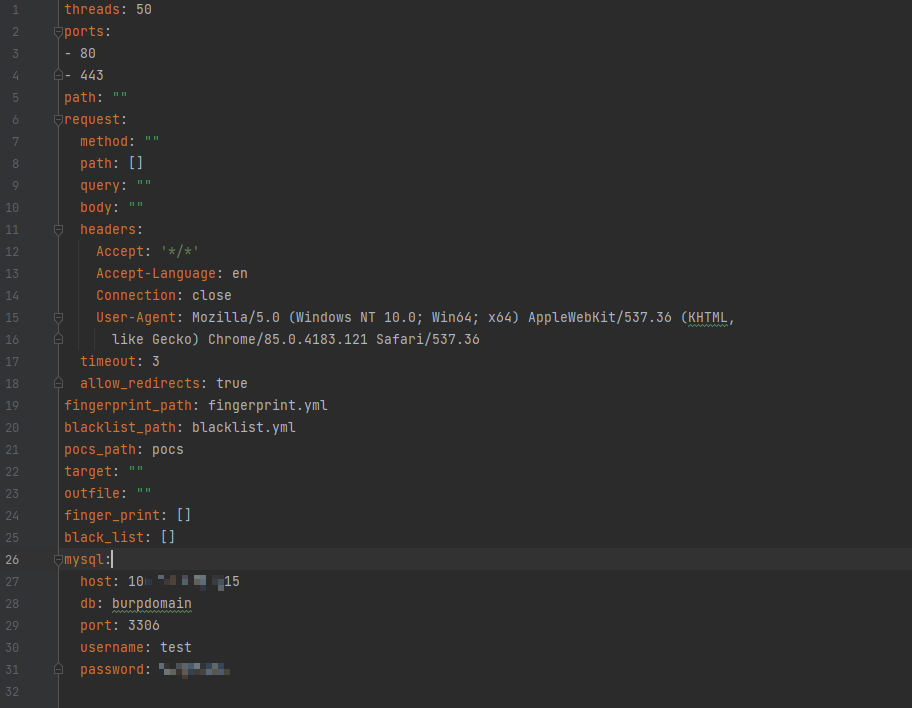

[中文](./README.md)|[English](./README_en.md)

# Sylas(塞拉斯) - 新一代子域名收集工具

原名：BurpDomain

作者：[@br0ken_5](https://github.com/broken5) && [@0chencc](https://github.com/0chencc)



## 项目描述

​	Sylas(塞拉斯)是我很喜欢的一款游戏《英雄联盟》(League of Legends)里的英雄。他在面板数值已经足够可观的情况下，其终极技能**其人之道**又能窃取其他英雄的终极技能为己用。我觉得塞拉斯很适合代表这个项目，我们在插件的基础功能开发完成之后，又再思考与其他项目联动的可能，尽可能地把我们手头上现有的idea跟这个项目联动融合，使Sylas成为战场上能独当一面的存在。——林晨[@0chencc](https://github.com/0chencc)


## 致谢

​	工具开发过程中参考了[@bit4woo](https://github.com/bit4woo)师傅的[domain_hunter_pro](https://github.com/bit4woo/domain_hunter_pro) 项目

## 功能

* 主动搜索

设定好根域名之后，会从历史流量中抓取与根域名相关的所有子域名展示并且储存到数据库中。

* 被动搜索

当使用burp代理时，会从经过burp的流量中抓取域名进行储存。不需要开启，插件启动以及数据库连接之后就会自动拉取。

* 相似域名模糊匹配

会对相似的域名进行匹配，符合正则的就拉取入库

* 支持mysql/sqlite

我们打算思考一下这个工具与后期其他工具的联动，故而选择了mysql作为数据库，根据鸭王师傅[@TheKingOfDuck](https://github.com/TheKingOfDuck)的反馈，我们又添加了Sqlite作为支持。目前是默认使用Sqlite作为数据库，降低用户的使用成本。

* 与Bscan的联动

这部分就是我所说的Mysql的联动，在目前的版本中，BurpDomain将支持定时每1分钟从Mysql数据库中拉取[Bscan](https://github.com/broken5/bscan/tree/sylas)测活的数据，但[Bscan](https://github.com/broken5/bscan/tree/sylas)的能力远不止于此。我在Todo List里添加了将Bscan漏扫的能力也结合在BurpDomain上。

如果有需要支持其他数据库，请大家在issue里反馈，我收到反馈之后会立即加上。

### TODO LIST

- [x] 支持sqlite
- [x] 相似域名模糊匹配
- [ ] url的后缀名筛选
- [ ] 由于仓促赶时间，所以当前的代码可读性是非常差的，会找个时间重构一下代码。
- [ ] Bscan漏扫能力结合

## 使用方法

### 0x00 配置数据库

在当前版本以及往后所有版本里，都支持了Sqlite，如果只是想单纯使用BurpDomain的功能，那么只需要Sqlite即可。

如果需要获得更强的功能，那么需要启动Mysql服务，并且在Mysql中创建一个数据库，将Mysql的连接配置设置好。


### 0x01 创建一个新项目

点击Project Setting按钮，输入项目名点击add，选中即可创建新项目

由于使用了数据库进行存储，所以会储存历史项目记录，当运行时会拉取数据库的项目信息，也可以直接选中继续项目。


### 0x02 添加根域名

点击RootDomain Setting按钮，将需要的爬取的根域名都添加上


### 0x03 域名收集

如果需要抓取历史流量，点击一下grep domains按钮即可。

配置完毕后无需再进行任何操作，下面是效果图


### 0x04 相似域名收集

使用如下代码进行相似域名匹配，正则在其中。各位有更优秀的正则可以提交issue，届时我们采纳使用。感谢。

```java
for(String s:BurpExtender.currentRootDomainSet){
  //思路：考虑将rootdomain进行切割，例如baidu.com使用切割成baidu com，然后对baidu进行相似度匹配
  String[] tmp = s.split("\\.");
  //通过切割的长度取需要匹配的部分，通过这个来避免当用户设置根域名为www.baidu.com的时候，会匹配成www,baidu的问题，目前直接取baidu,com
  String similarRegex = String.format("((?!-)[A-Za-z0-9-]{1,63}(?<!-)\\.)*(?!-)[A-Za-z0-9-]{0,63}%s[A-Za-z0-9-]{0,63}(?<!-)\\.%s",
                                      tmp[tmp.length-2],tmp[tmp.length-1]);
  Pattern similarPattern = Pattern.compile(similarRegex);
  Matcher matcher = similarPattern.matcher(domain);
  return matcher.find();
}
```


### 0x05 工具特点

根据字段排序功能可以快速筛选出内网IP、相似网段IP以及相似域名，可以根据这些信息自定义域名字典、爆破HOST等，进一步扩大信息收集范围


### 0x06 与Bscan的联动

#### Sylas配置

需要将配置数据库的方式修改为Mysql，按照图示进行填写配置。


在Sylas以及Bscan都配置完毕后该功能就会启用。

在配置完毕Bscan之后，需要重新连接一次Mysql数据库。查看Burp-Extender有无打印出Bscan Ready字符串，如果打印则该功能已启用。



这项功能只在配置了Bscan以及Mysql的用户才可以体验。目前仅支持批量网站测活，效果如下。



需要在[Bscan](https://github.com/broken5/bscan/tree/sylas)的配置文件里配置塞拉斯的数据库信息，随后按照readme中的方法启动即可。

#### Bscan配置

##### 0x00 初始化

```shell
./bscanSylas
```


执行这条命令之后会报错且生成配置文件

##### 0x01 修改Config.yml文件

打开生成的Config.yml文件

在sylas字段里修改关于塞拉斯数据库的配置。



##### 0x02 启动

直接以nohup去启动本程序，程序会在启动时在数据库中自动创建需要的表名
```shell
nohup ./bscanSylas &
```
随后程序将在每1分钟自动拉取塞拉斯数据库，进行扫描之后将扫描结果储存在数据库中，以供塞拉斯去拉取。

在最新的版本中，我们新增了与Bscan的联动，也在后续寻找跟其他工具结合的可能。Bscan一直没有开源的原因只是B哥觉得代码写得有点丑，不过这次我们在分支上进行代码开源，更强的Bscan得等下个月忙完才能更新了。