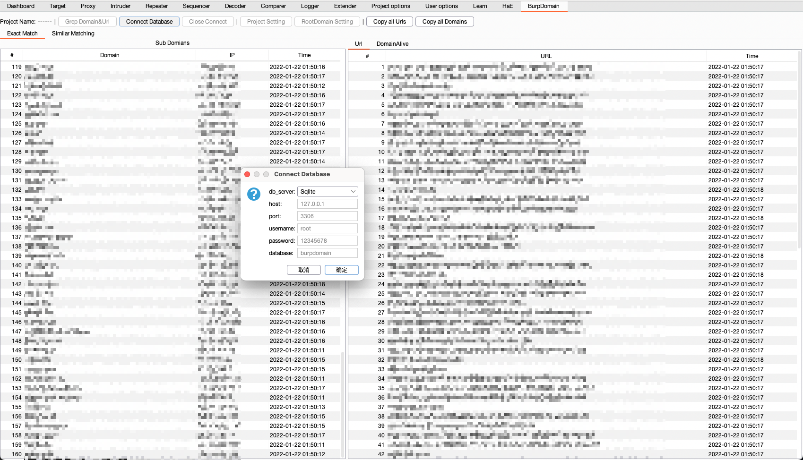
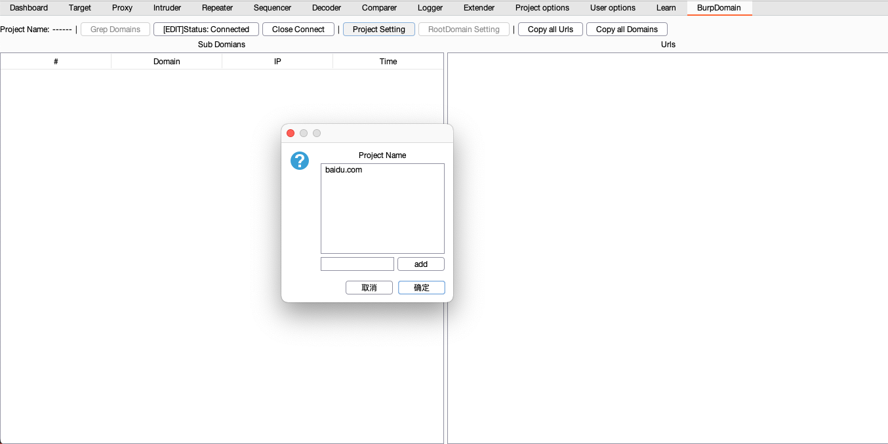
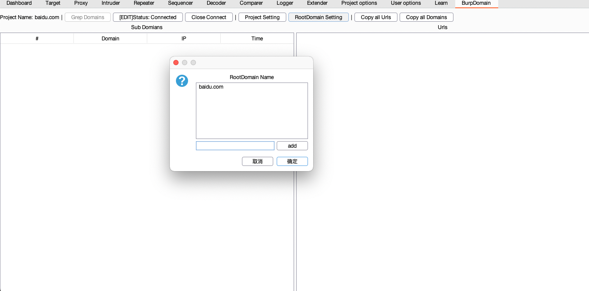
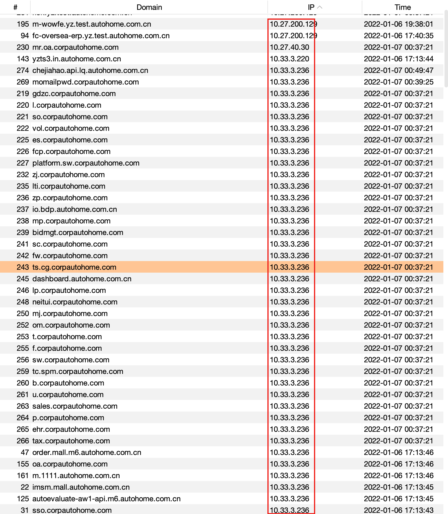
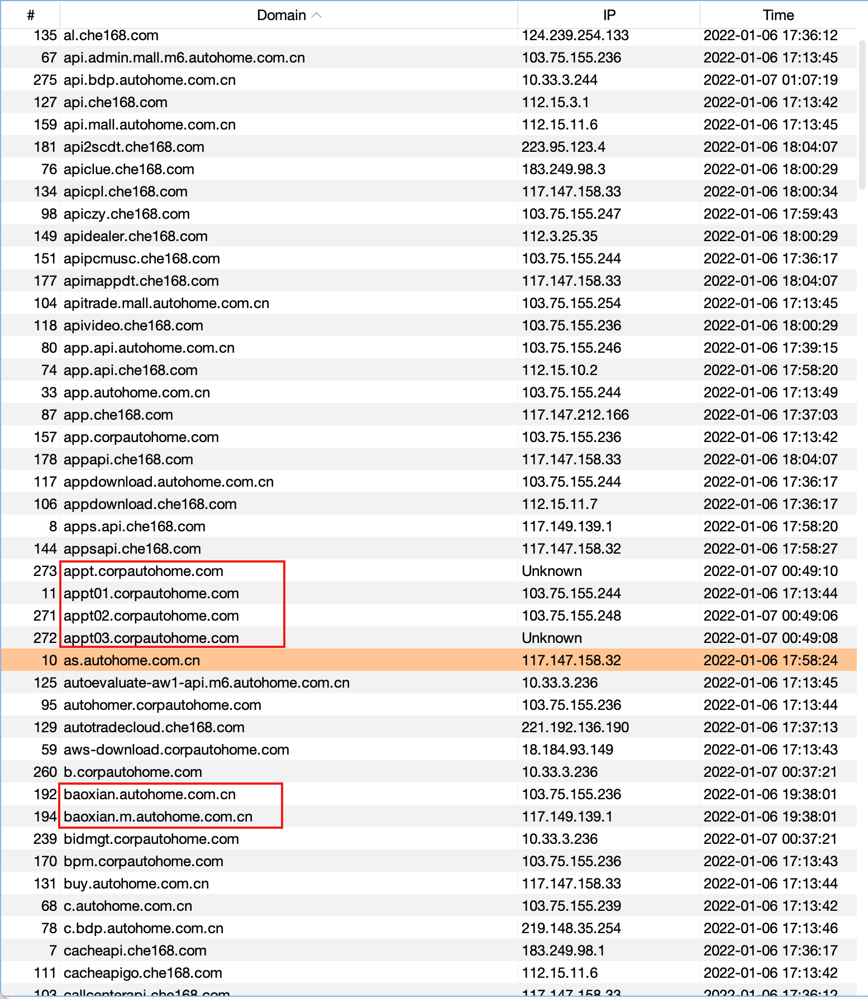

# BurpDomain - 新一代子域名收集工具

作者：[@br0ken_5](https://github.com/broken5) && [@0chencc](https://github.com/0chencc)

## 致谢

工具开发过程中参考了[@bit4woo](https://github.com/bit4woo)师傅的[domain_hunter_pro](https://github.com/bit4woo/domain_hunter_pro) 项目

## 功能

* 主动搜索

设定好根域名之后，会从历史流量中抓取与根域名相关的所有子域名展示并且储存到数据库中。

* 被动搜索

当使用burp代理时，会从经过burp的流量中抓取域名进行储存。不需要开启，插件启动以及数据库连接之后就会自动拉取。

* 支持mysql/sqlite

我们打算思考一下这个工具与后期其他工具的联动，故而默认选择了mysql作为数据库，根据鸭王的反馈，我们又添加了sqlite作为支持。

如果有需要支持其他数据库，请大家在issue里反馈，我收到反馈之后会立即加上。

### TODO LIST

- [x] 支持sqlite
- [ ] 由于仓促赶时间，所以当前的代码可读性是非常差的，会找个时间重构一下代码。

## 使用方法

### 0x00 配置数据库

将插件加载到burp之后，需要启动Mysql服务，并且在Mysql中建立一个数据库，将Mysql的连接配置设置好。

### 0x01 创建一个新项目

点击Project Setting按钮，输入项目名点击add，选中即可创建新项目

由于使用了数据库进行存储，所以会储存历史项目记录，当运行时会拉取数据库的项目信息，也可以直接选中继续项目。

### 0x02 添加根域名

点击RootDomain Setting按钮，将需要的爬取的根域名都添加上

### 0x03 域名收集

如果需要抓取历史流量，点击一下grep domains按钮即可。

配置完毕后无需再进行任何操作，下面是效果图

### 0x04 工具特点

根据字段排序功能可以快速筛选出内网IP、相似网段IP以及相似域名，可以根据这些信息自定义域名字典、爆破HOST等，进一步扩大信息收集范围

